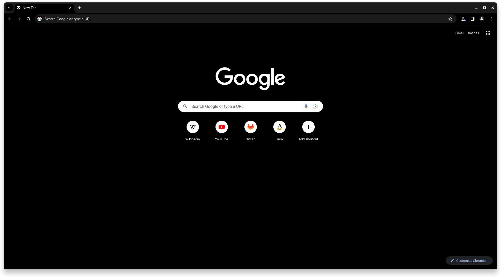
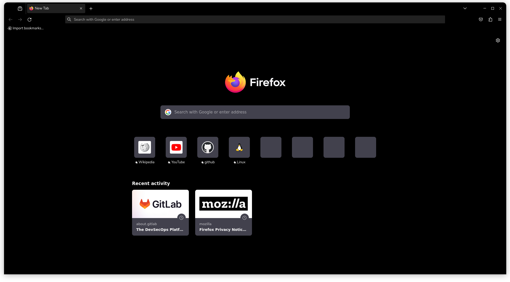

# Black Pixel Theme
[][chromestore] [][firefoxaddons]

Black theme with blue accents for [Google Chrome][chrome], [ChromeOS][chromeos], [Microsoft Edge][edge], and [Mozilla Firefox][firefox], inspired by Google's [Material Design][material] for their Pixel series of smartphones.

## Preview

[chromestore]: https://chromewebstore.google.com/detail/black-pixel/nfpfolfbmhaemdcmejphhdhjbpmjgknc
[firefoxaddons]: https://addons.mozilla.org/en-US/firefox/addon/black-pixel/
[chrome]: https://www.google.com/chrome/
[chromeos]: https://www.google.com/chromebook/chrome-os/
[edge]: https://www.microsoft.com/edge
[firefox]: https://www.mozilla.org/firefox/
[material]: https://material.io/
